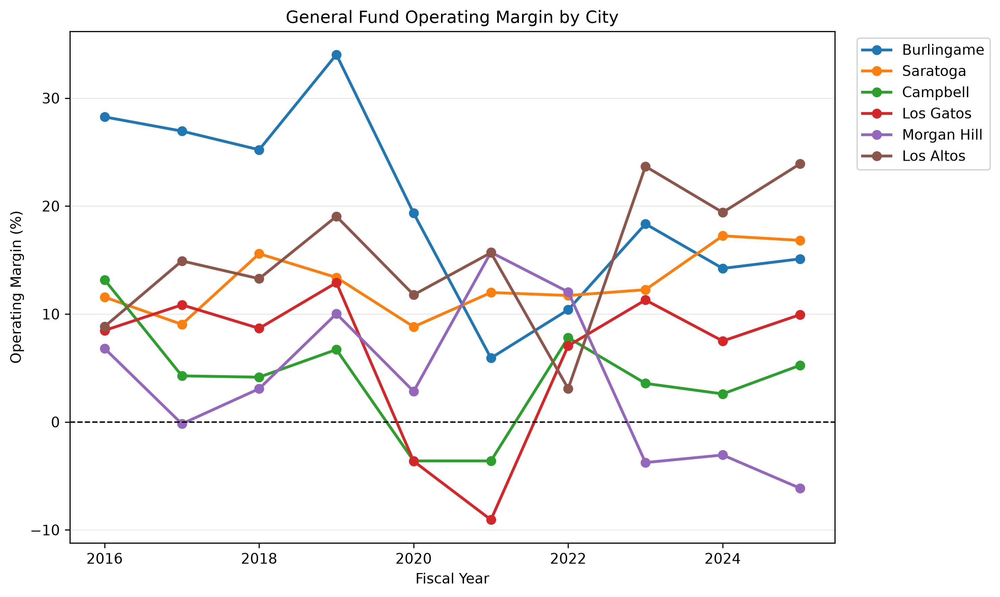
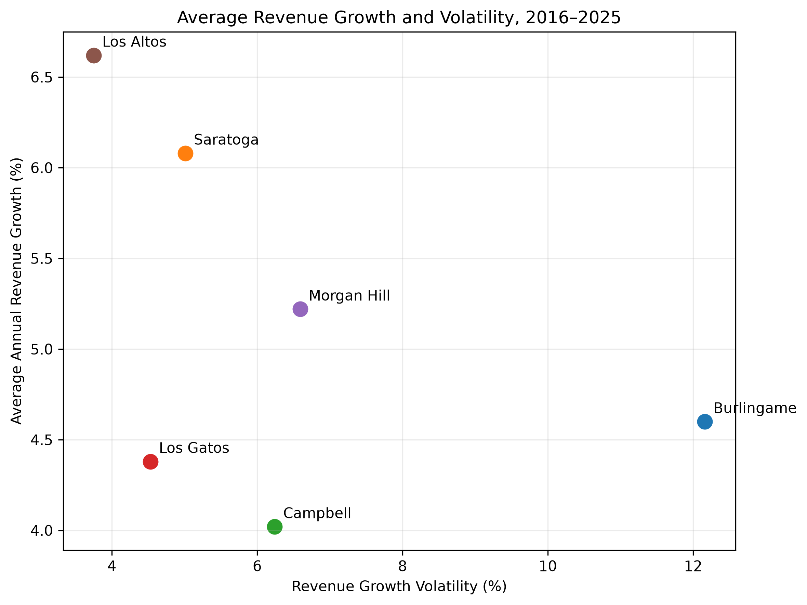
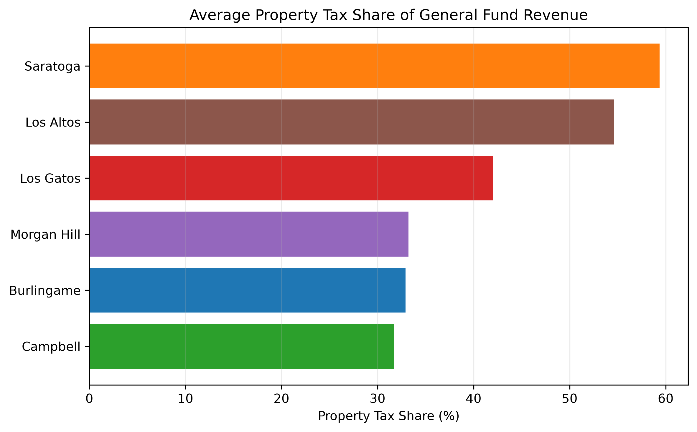
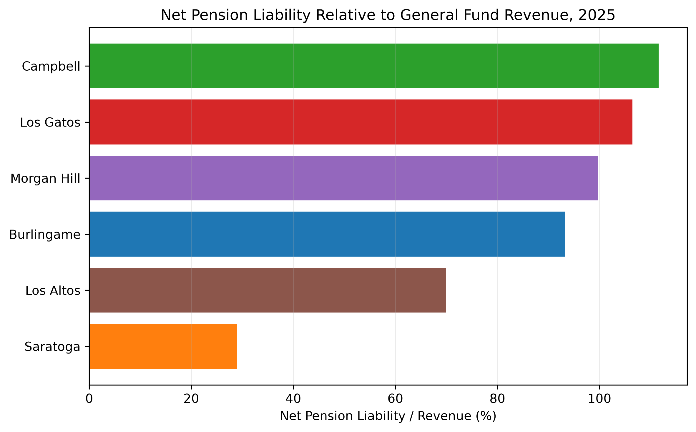
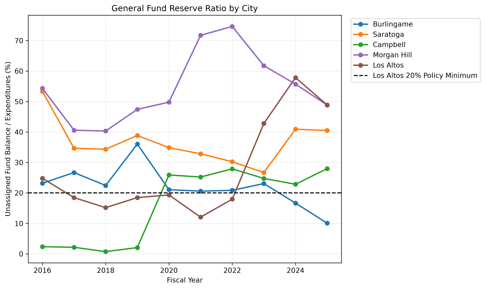

# Bay Area Municipal Fiscal Health: A 10-Year Comparative Analysis

## Overview

This project analyzes the fiscal health of six Bay Area municipalities from 2016–2025 using financial data I collected during my Finance internship with the City of Los Altos.

The analysis compares Los Altos with five peer cities:

- Burlingame
- Campbell
- Los Gatos
- Morgan Hill
- Saratoga

Using Python, I cleaned and combined ten years of municipal financial data, constructed fiscal performance metrics, and evaluated differences in operating performance, revenue stability, revenue structure, reserves, and pension obligations.

The goal is to understand how Los Altos' fiscal position has evolved over time and how its financial structure compares with similar municipalities.

## Key Questions

- How has General Fund operating performance changed across the six cities?
- Which cities experienced the strongest and most stable revenue growth?
- How dependent are municipalities on property tax revenue?
- How do pension liabilities compare relative to each city's revenue base?
- How have General Fund reserve positions changed over time?

## Key Insights

- **Los Altos combined strong growth with relatively low volatility.** Average annual General Fund revenue growth was approximately 6.6% from 2016–2025, while revenue-growth volatility was the lowest among the six cities at approximately 3.8%.

- **Los Altos consistently generated positive operating results.** Its average operating margin was approximately 15.4%, reflecting a sustained pattern of General Fund revenues exceeding expenditures.

- **Property taxes play an unusually large role in Los Altos' revenue structure.** Property taxes represented approximately 54.6% of General Fund revenue on average over the ten-year period. Only Saratoga had a higher average share.

- **Los Altos carried a relatively moderate pension liability compared with several peers.** Net Pension Liability averaged approximately 76% of annual General Fund revenue, below the levels observed in Campbell, Los Gatos, and Morgan Hill.

- **Los Altos' reserve position increased substantially in recent years.** The General Fund reserve ratio rose from approximately 12% in 2021 to nearly 49% in 2025. During my internship, part of this reserve accumulation was associated with funding plans for a future Police Department facility.

## Analysis

### General Fund Operating Performance

Operating margin measures the difference between General Fund revenue and expenditures as a percentage of revenue.

The comparison highlights differences in annual fiscal performance across municipalities and shows that Los Altos maintained positive operating margins throughout the period.

### Revenue Growth and Stability

This analysis compares each city's average annual revenue growth with the standard deviation of its annual revenue growth.

Los Altos stands out for combining relatively high average revenue growth with comparatively low volatility.

### Property Tax Dependence

Property tax dependence varies considerably across the peer group.

Los Altos and Saratoga rely much more heavily on property taxes than the other municipalities. This does not necessarily indicate greater fiscal risk, since property taxes can provide a relatively stable revenue base, but it does mean that their revenue structures are more closely tied to property values.

### Pension Liability

Net Pension Liability is compared with General Fund revenue to make pension obligations more comparable across cities of different sizes.

Los Altos had a lower pension-liability-to-revenue ratio than several peer municipalities in 2025.

### General Fund Reserves

The reserve ratio measures unassigned General Fund balance relative to annual General Fund expenditures.

Los Altos' reserve position increased sharply after 2021. The chart also includes Los Altos' 20% reserve policy minimum for context.

During my internship, I learned that part of the reserve accumulation above the policy minimum was associated with preparation for a future Police Department facility. This provides important context when interpreting the increase in reserves.

Los Gatos is excluded from the reserve trend comparison because its reserve reporting was not directly comparable across the full ten-year period.

## Data

The dataset contains annual financial information for six Bay Area municipalities from FY2016 through FY2025.

The underlying data were collected from publicly available municipal financial reports during my Finance internship with the City of Los Altos.

Variables used in the analysis include:

- Population
- General Fund revenue
- General Fund expenditures
- Capital Improvement Program spending
- Unassigned General Fund balance
- Property tax revenue
- Pension funding ratios
- Net Pension Liability

Several additional metrics were calculated in Python, including:

- Operating surplus
- Operating margin
- Revenue and expenditures per capita
- Revenue growth
- Revenue-growth volatility
- Reserve ratio
- Property-tax share of General Fund revenue
- Net Pension Liability relative to revenue
- Net Pension Liability per capita

## Tools & Skills Demonstrated

- Python
- pandas
- matplotlib
- Excel data cleaning and transformation
- Financial ratio analysis
- Time-series analysis
- Summary statistics
- Data visualization
- Municipal financial benchmarking
- Public-sector financial analysis

## Project Structure

    municipal-fiscal-analysis/
    ├── analysis/
    │   └── municipal_fiscal_analysis.py
    ├── data/
    │   └── municipal_kpi_raw.xlsx
    ├── figures/
    │   ├── operating_margin_trend.png
    │   ├── revenue_growth_vs_volatility.png
    │   ├── property_tax_share.png
    │   ├── npl_to_revenue_2025.png
    │   └── reserve_ratio_trend.png
    ├── .gitignore
    └── README.md

